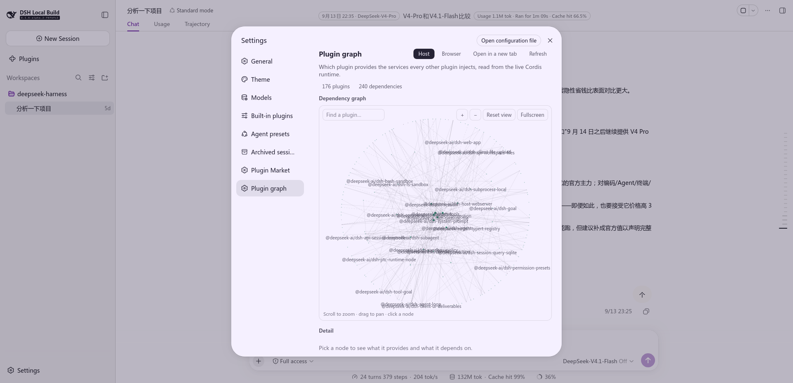
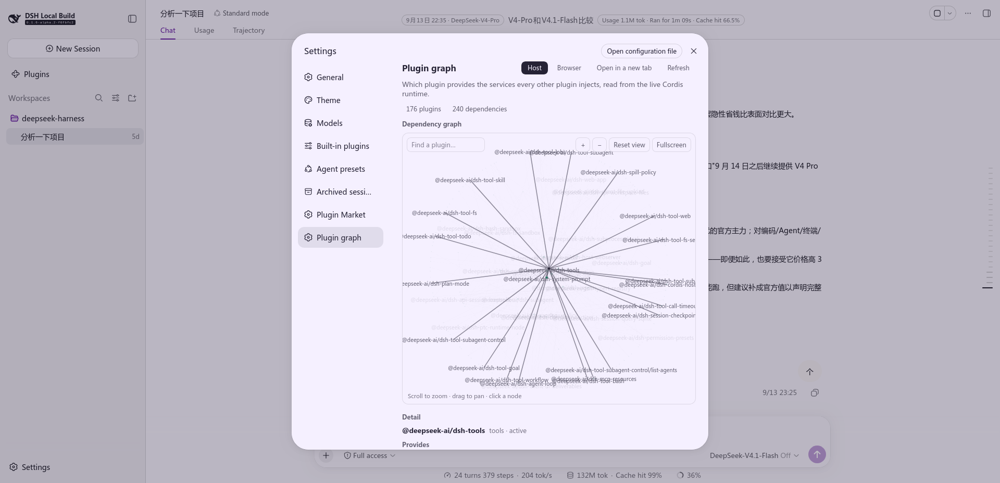
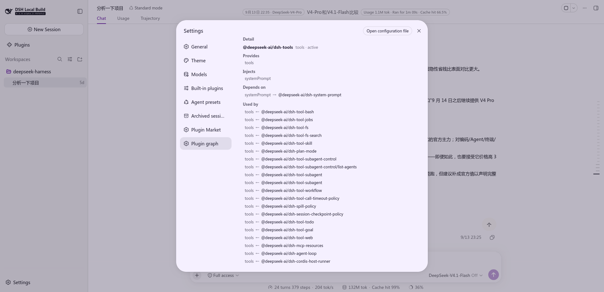
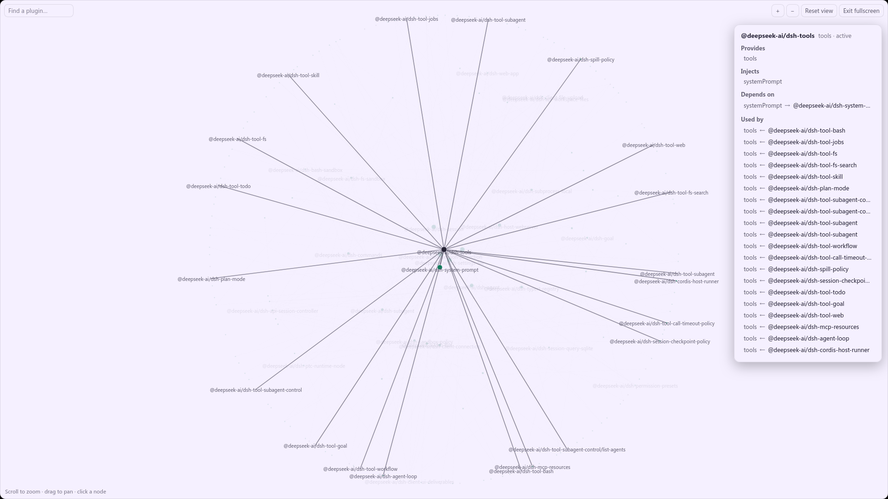
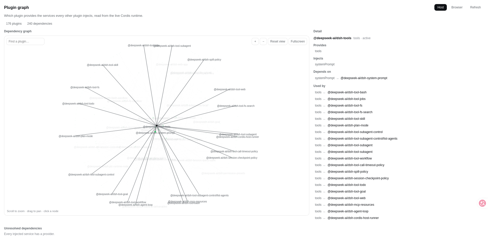

English | [中文](README.zh.md)

# Plugin graph

Which plugin provides the services every other plugin injects — read from the live Cordis
runtime, not from a manifest.

A settings section draws the graph, and a standalone page shows the same graph at full width.
Both render the *same* panel: the two hosts differ only in what they can supply (a locale
service, a theme, a window instead of a settings column).

## Screenshots

The section, as it opens: the graph, the counts, the search box, and a detail column waiting for
a selection.



Selecting a node: the drawing keeps only what touches that node, and the detail column fills in.



The detail itself. **Depends on** names the service *and* the provider that answers it, which is
the question the graph exists to answer; **Used by** lists every consumer.



Fullscreen: the drawing fills the window and the detail moves onto the canvas as an overlay —
the column beside it is not on screen there.



The standalone viewer, opened in a new tab: the same graph at the width of a whole window, with
the problems block underneath.



## The two trees

There are two Cordis runtimes, and they get two graphs:

| | Host | Browser |
|---|---|---|
| Where it runs | the Node process | the page |
| Collected by | `collectGraph(ctx)` on the host | `collectGraph(ctx.root)` in the page |
| Shown by | this section, fetched over HTTP | reported by the page, read back by the viewer |

**They are never merged.** They are different runtimes with different plugins and different
service names, so a merged graph would not be a bigger one — it would be a wrong one. The
Browser tab is a second *source*, not a second set of nodes.

The browser tree cannot be collected by the Node half, so the page is the only thing that can
describe it: the section POSTs what it collected to `/dsh-plugin-graph/client`, and the viewer
GETs it back (one path, two methods). The report carries **the instant it was taken**, and the
viewer prints it — a graph a reader believes is current but is not is worse than one that admits
its age.

## How a dependency is acquired

A plugin can take a service two ways, and the difference is not cosmetic:

- **Declared** on the plugin (`export const inject = [...]`, an `inject:` option, or the
  `@Inject` decorator) — the fiber stays pending until every one of them resolves. The plugin
  does not load without them.
- **At runtime**, through the `ctx.inject(deps, callback)` helper — the callback runs once they
  appear. The plugin loads either way; only that contribution waits.

Both are real dependencies, both get edges, and the second is what the `optional` mark means. A
missing *required* service is a broken composition; a missing *optional* one is the ordinary
case the callback form exists for.

The collection reads three things, and the distinction matters: the **Loader entries** give the
ids and package names, the **reflection store** is the authoritative provider table (keyed by
isolation symbol — the fiber's own `store` is the wrong source and would name consumers as
providers), and the **registry** supplies every live fiber, including ones started at runtime.

## Reading the graph

- **Search** filters by name as you type.
- **Scroll** zooms, **drag** pans, a **click** selects.
- **Fullscreen** fills the window. The detail follows onto the canvas, because the column is not
  on screen there.
- **Open in a new tab** hands the graph to the standalone viewer — a whole page, served by the
  Node half, which is the point: an iframe or a route inside the app would inherit the same
  width the reader is trying to get away from.
- **Open configuration file** jumps to this plugin's row in the settings editor.

## What the graph reports

Two blocks sit under the drawing, and both are about work rather than about drawing:

- **Unresolved dependencies** — required services with no provider anywhere in this composition.
  Only *required* ones: an optional injection with no provider has simply not been offered yet,
  and the plugin is working as designed.
- **Isolated services** — one service name with more than one live implementation, i.e. provided
  under more than one isolation label.

## The standalone viewer

A page the Node half serves as a whole document. It has no Cordis of its own, so it can only
show the host's tree plus the browser report the app sent — and it reads two things from the URL
it was opened with, because it cannot read them any other way:

| Parameter | Why |
|---|---|
| `?scheme=dark\|light` | the page styles itself with the app's `--dsw-*` tokens; the attribute that switches them is the app's, not this page's |
| `?lang=zh\|en\|ja\|ko\|es\|fr\|de` | so the new tab opens in the language the app is **in**, instead of guessing from the browser |

The locale is whitelisted against the dictionaries before it reaches the document — a query
string is not a place to trust, and that value ends up in the page's `lang` attribute. A page
opened directly (no parameter) falls back to the browser's own preferences, then to English.

The browser report lives in memory only, never on disk: it describes a runtime that exists while
the page is open, and a report that outlived a host restart would be describing something that
is not there.

## Language

Seven dictionaries in `src/client/locales.ts`: `zh` and `en` (the two the shell carries) plus
`ja`, `ko`, `es`, `fr` and `de`, contributed one namespace at a time through the single-locale
overload — the language pack a profile carries owns the *definition* that makes a language
selectable, and this plugin adds only its own strings to it. It deliberately does not call
`addLanguage`.

Every dictionary is typed `Record<MessagesKey, string>`, so a key added to `MessagesKey` fails to
compile until all seven carry it. Wording follows `session-messages`, which shipped these five
first: the plugins sit in one interface, so a reader must meet the same terms in both.

## Layout

```text
plugin-graph-plugin/
  package.json        dsh.bundle + dsh.client declarations, exports map (private, not published)
  cordis.patch.yml    layer patch: the Loader row
  build.mjs           build script: bundles both halves, and copies the theme at build time
  tsconfig.json       IDE type resolution only, pointing at the checkout source (read-only)
  src/
    index.ts                 Node half: collectGraph, and the routes below
    graph-types.ts           the wire shape both halves share (types + path constants)
    collect.ts               the collector, one function for both runtimes
    viewer-page.ts           the standalone page's document, as a string
    viewer/main.tsx          the standalone page's body (React bundled in — that page has no
                             module table to answer a bare `react` import)
    client/
      index.ts               registers the settings section
      GraphPanel.tsx         the panel both hosts render
      graph-canvas.tsx       the drawing: layout, hit testing, zoom/pan
      locales.ts             the seven dictionaries
  docs/                      the screenshots above (chinese variants: `-zh.png`)
```

Routes, all under `/dsh-plugin-graph`: the graph itself, `/view` (the page), `/viewer.js`, and
`/theme.css` — plus `/client`, which takes a POST from the app and answers a GET for the viewer.

## Development

```sh
npm run build     # bundles lib/index.js, lib/client.js and lib/viewer.js
npx tsc -p tsconfig.json   # type check
```

Install as a plugin in a DSH checkout by adding this directory's `cordis.patch.yml` to the
bundle: it inserts the single Loader row. Nothing here needs the host's source to be modified —
that is a constraint this plugin is built to, not a coincidence.
